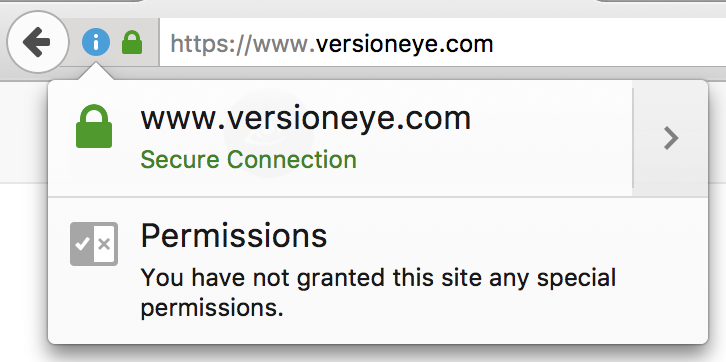
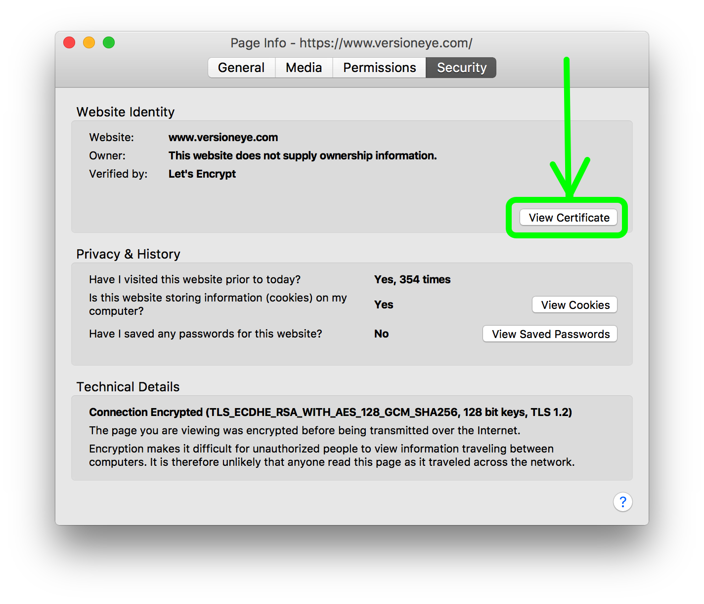
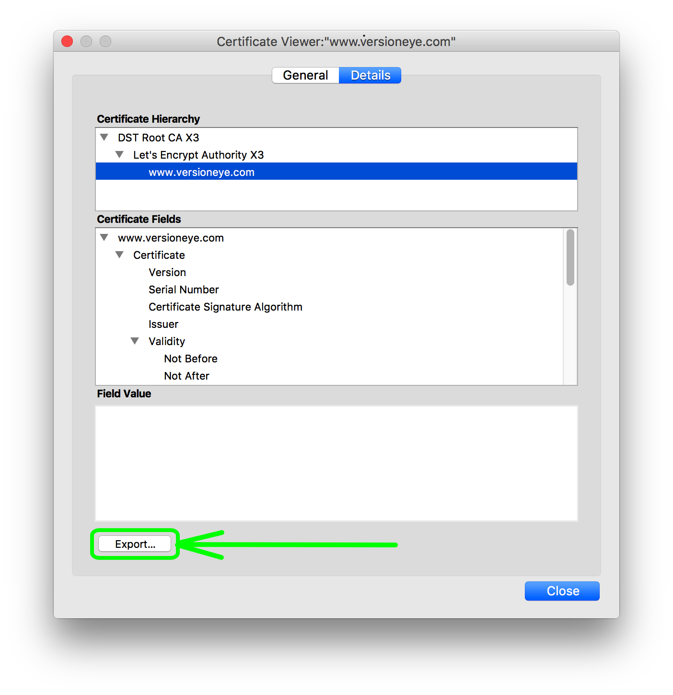
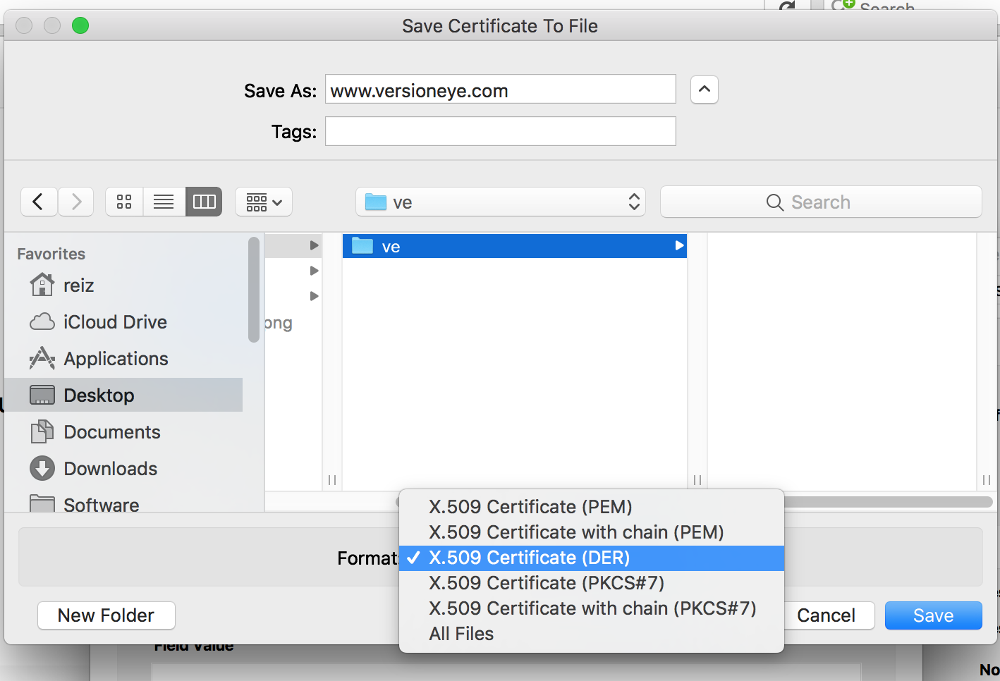

## Importing site certificate into Java Runtime

The crawlj container(s) are running on Java. When the Java process attempts to connect to a server that has an invalid or self signed certificate, such as an Maven repository server (Artifactory or Sonatype) in a development environment, there might be the following exception:

```
javax.net.ssl.SSLHandshakeException: 
sun.security.validator.ValidatorException: PKIX path building failed:
sun.security.provider.certpath.SunCertPathBuilderException: 
unable to find valid certification path to requested target
```

To make the Java runtime trust the certificate, it needs to be imported into the JRE certificate store.

### Step 1 - Get the certificate into your browser store

Browse to your application server using SSL. In pretty much all Browsers it is possible to export the site certificate. Here is described how it works in Firefox. 



Click on the domain. 



In the Security tab click on "View Certificate". 



Select the domain and click Export. 



In the download dialog select the `DER` binary format and save the file to localhost.


### Step 2 - Import the certificate into the Java Store

In general the certificate can be imported to the Java Runtime with this command:

```
keytool -import -alias alias -keystore path-to-jre/lib/security/cacerts -file path-to-certificate-file
```

In the crawlj container we are using Ubuntu and OpenJDK. The JRE is here:

```
/usr/lib/jvm/java-8-openjdk-amd64/jre
```
And the default keychain is here:

```
/etc/ssl/certs/java/cacerts
```

The full import command would look like this: 

```
keytool -import -alias versioneye -storepass changeit -noprompt -keystore /usr/lib/jvm/java-8-openjdk-amd64/jre/lib/security/cacerts -file /certs/www.versioneye.com
```

By default the keystore is protected by a password, which is by default `changeit`. With `-storepass changeit -noprompt` the password is provided and any prompt disabled. 

### Step 3 - Automation with Docker Compose

The steps above can be executed manually but if the Docker container is restarted they have to be executed again. That's why it's better to get the job done within the Docker Composer config. 

Place your DER certificate into the `certs` directory in the root of the `ops_contrib` (this) directory. There are 2 shell scripts in the `certs` directory which are deleteing and importing a certificate. In both scripts the `alias` and the file path to the certiticate needs to be adjusted.

Then the directory can be mounted into the `crawlj` Docker container and the default `RUN` command can be overwritten with `command`. Here an example: 

```
crawlj:
  image: versioneye/crawlj:${VERSION_CRAWLJ}
  container_name: crawlj
  restart: always
  environment:
    TZ: Europe/London
  volumes:
   - /mnt/logs:/mnt/logs
   - /mnt/ops_contrib/certs/:/certs
  command: "/certs/import_to_crawlj.sh"
  external_links:
   - rabbitmq:rm
   - memcached:mc
   - elasticsearch:es
   - mongodb:db
```
Now if the Docker containers is starting it will have the certificate mounted and it will execute the `/certs/import_to_crawlj.sh` script which is adding the certificate to the keychain. 

And the `crawlj_worker` container would look like this:

```
crawlj_worker:
  image: versioneye/crawlj_worker:${VERSION_CRAWLJ_WORKER}
  restart: always
  environment:
    TZ: Europe/London
  volumes:
   - /mnt/logs:/mnt/logs
   - /mnt/ops_contrib/certs/:/certs
  command: "/certs/import_to_crawlj_worker.sh"
  external_links:
   - rabbitmq:rm
   - memcached:mc
   - elasticsearch:es
   - mongodb:db
```
